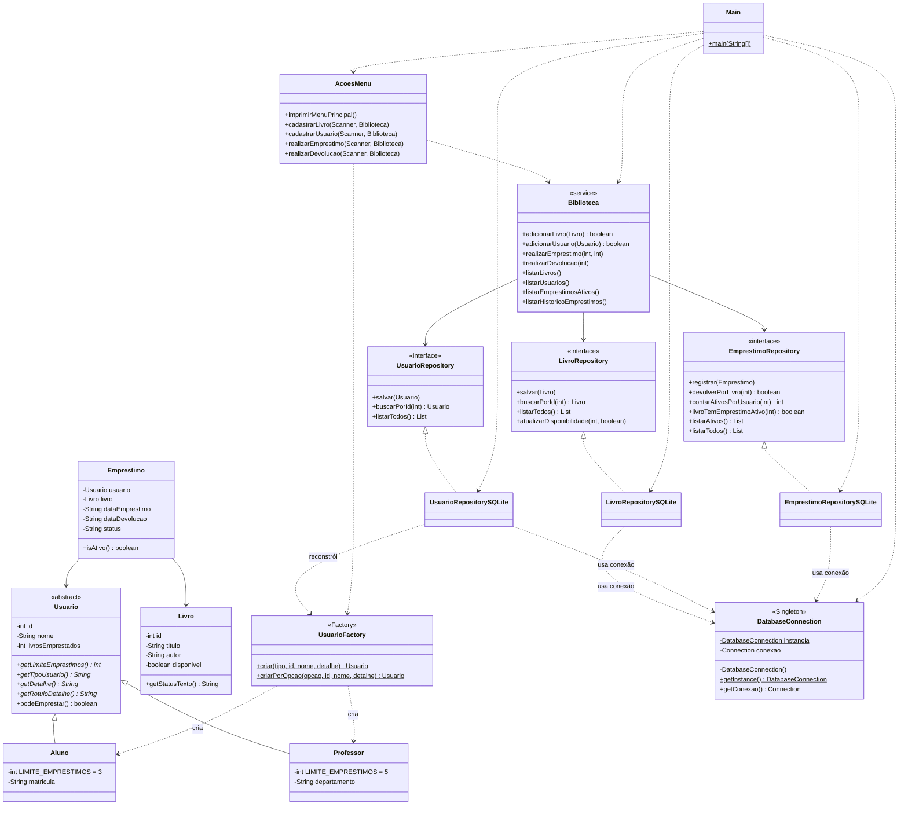
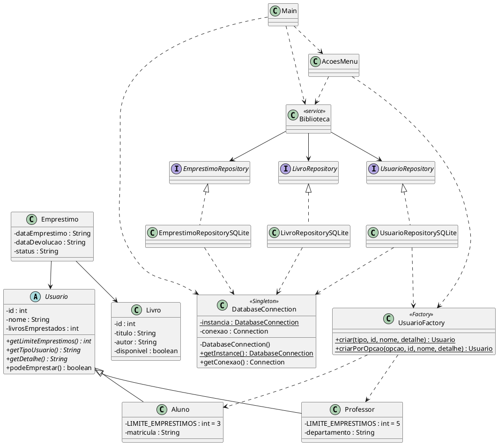

# Diagrama de Classes — atualizado (N2)

Duas versões do mesmo diagrama: **Mermaid** (renderiza direto no GitHub/VS Code) e
**PlantUML** (cole em https://www.plantuml.com/plantuml para exportar um PNG, caso a
entrega exija imagem).

---

## Versão Mermaid



---

## Versão PlantUML



---

## Modelo do Banco (relacionamentos)

```
usuarios (1) ───< emprestimos >─── (1) livros
            id_usuario        id_livro

- 1 usuário pode ter vários empréstimos.
- 1 livro pode aparecer em vários empréstimos ao longo do tempo.
- A tabela "emprestimos" resolve o N:N e guarda o histórico (status ATIVO/DEVOLVIDO).
```
