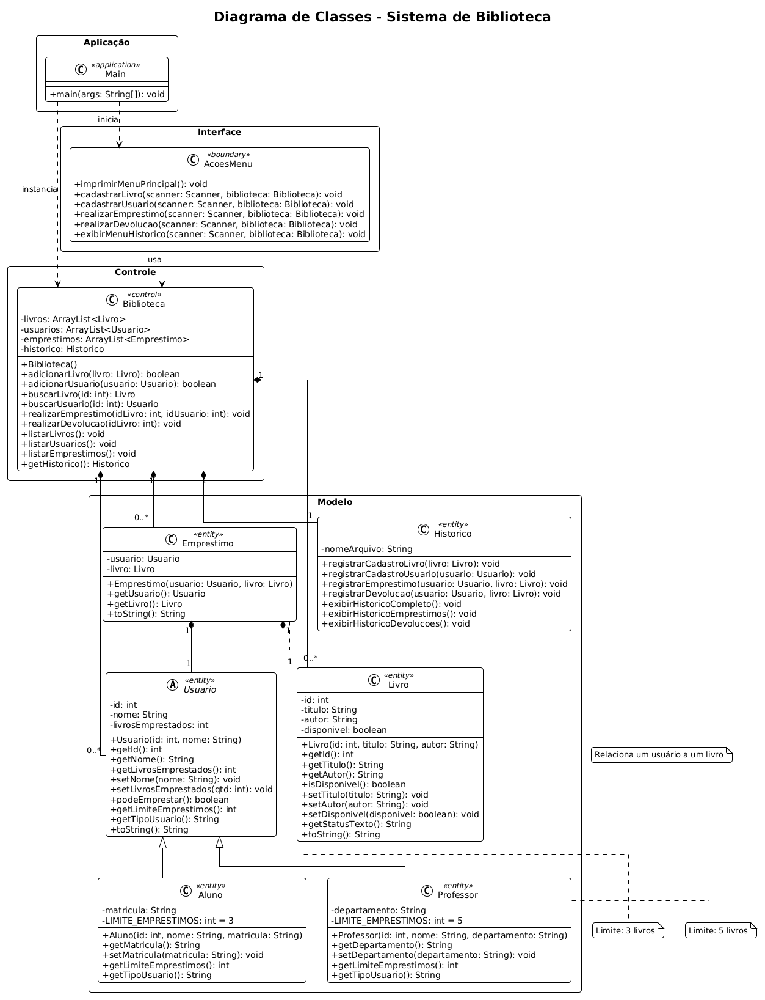

# Sistema de Gerenciamento de Biblioteca

**Universidade Católica de Brasília - UCB**
**Disciplina:** Programação Orientada a Objetos
**Professor:** Alexandre S. D. Santos
**Data:** 12/04/2026

**Alunos:**
- Leonardo Rodrigues Amorim Filho
- Caio Eduardo Moura dos Santos
- Caio Monte Lopes
- Caio Gabriel Timotio Rodrigues de Lima

---

> 🚀 **Etapa 2 (N2) — Evolução do projeto:** esta versão inicial armazena os dados em memória (`ArrayList`) e registra o histórico em arquivo de texto. A evolução do sistema — com **persistência em SQLite** e os padrões de projeto **Singleton**, **Factory** e **Repository/Interface** — está na pasta **[`N2/`](./N2)**. Comece pelo [README do N2](./N2/README.md).

---

## Descrição do Projeto

Sistema completo de gerenciamento de biblioteca desenvolvido em Java, baseado nos princípios de Programação Orientada a Objetos (POO). O sistema permite o cadastro de livros e usuários (alunos e professores), controle de empréstimos e devoluções, com regras de negócio que limitam a quantidade de livros por tipo de usuário.

O projeto inclui um sistema de **histórico persistente** que registra todas as operações realizadas em um arquivo de texto (`historico.txt`), permitindo consultar quem emprestou, quem devolveu, quais livros existem e quais usuários estão cadastrados — mesmo após encerrar e reiniciar o programa.

A arquitetura do projeto foi baseada no projeto de referência **locadoradecarros**, adaptando a lógica de aluguel de veículos para empréstimos de livros em uma biblioteca universitária.

---

## Arquitetura do Sistema

O sistema é composto por **8 classes Java** organizadas em três camadas lógicas:

### Camada de Modelo (Entidades)

- **`Usuario`** (classe abstrata): Classe base que define os atributos e comportamentos comuns a todos os usuários da biblioteca. Possui os atributos privados `id`, `nome` e `livrosEmprestados`, além dos métodos abstratos `getLimiteEmprestimos()` e `getTipoUsuario()` que obrigam cada subclasse a definir seus próprios valores. Contém o método concreto `podeEmprestar()` que compara a quantidade atual de empréstimos com o limite permitido.

- **`Aluno`** (herda de Usuario): Representa um aluno da universidade. Define o limite máximo de **3 empréstimos** simultâneos através da constante `LIMITE_EMPRESTIMOS = 3` e adiciona o atributo específico `matricula` (número de matrícula do aluno).

- **`Professor`** (herda de Usuario): Representa um professor da universidade. Define o limite máximo de **5 empréstimos** simultâneos através da constante `LIMITE_EMPRESTIMOS = 5` e adiciona o atributo específico `departamento` (área de atuação do professor).

- **`Livro`**: Representa um livro do acervo da biblioteca. Possui os atributos `id`, `titulo`, `autor` e `disponivel` (boolean que controla o status). O atributo `disponivel` inicia como `true` (Disponível) e muda para `false` (Emprestado) automaticamente quando o livro é emprestado. O método `getStatusTexto()` retorna a representação legível do status ("Disponível" ou "Emprestado").

- **`Emprestimo`**: Classe de associação que vincula um `Usuario` a um `Livro`, representando um empréstimo ativo. Armazena referências aos dois objetos envolvidos na operação.

- **`Historico`**: Classe responsável por registrar todas as operações do sistema em um arquivo de texto (`historico.txt`). Utiliza `BufferedWriter` (modo append) para escrita persistente e `BufferedReader` para leitura. Cada registro inclui a data/hora no formato `dd/MM/yyyy HH:mm:ss` e uma tag identificando o tipo de operação (`CADASTRO_LIVRO`, `CADASTRO_USUARIO`, `EMPRESTIMO`, `DEVOLUCAO`). Permite exibir o histórico completo ou filtrado por tipo de operação.

### Camada de Controle (Lógica de Negócio)

- **`Biblioteca`**: Classe controladora central do sistema. Gerencia três listas (`ArrayList`): livros, usuários e empréstimos. Contém toda a lógica de validação e negócio, incluindo: verificação de IDs duplicados antes do cadastro, verificação de disponibilidade do livro, verificação do limite de empréstimos por tipo de usuário, e atualização automática de status (livro e contador do usuário) nas operações de empréstimo e devolução. Integra com a classe `Historico` para registrar cada operação com data e hora.

### Camada de Apresentação (Interface)

- **`AcoesMenu`**: Classe responsável pela interação com o usuário via terminal (CLI). Exibe o menu principal com opções de 0 a 8, coleta os dados necessários para cada operação e realiza validações antecipadas (como verificação de ID duplicado **antes** de solicitar os demais dados). Inclui um submenu de histórico com filtros por tipo de operação.

- **`Main`**: Ponto de entrada do programa. Inicializa o `Scanner`, a `Biblioteca` e o `AcoesMenu`. Mantém o loop principal do menu (`do-while`) ativo até que o usuário escolha a opção 0 (Sair).

---

## Diagrama de Classes

O diagrama de classes do sistema está disponível na imagem abaixo, localizada na raiz do projeto:




### Relacionamentos

- **Herança:** `Aluno` e `Professor` herdam de `Usuario` (classe abstrata).
- **Associação:** `Emprestimo` associa um `Usuario` a um `Livro`.
- **Composição:** `Biblioteca` contém listas de `Livro`, `Usuario`, `Emprestimo` e uma instância de `Historico`.
- **Dependência:** `AcoesMenu` depende de `Biblioteca` e `Historico` para executar as operações.
- **Dependência:** `Main` depende de `AcoesMenu` e `Biblioteca` para o loop do menu.

---

## Princípios de POO Aplicados

| Princípio | Implementação |
|---|---|
| **Encapsulamento** | Todos os atributos de todas as classes são `private`, com acesso controlado exclusivamente via getters e setters. Nenhum atributo é acessado diretamente de fora da classe. |
| **Herança** | `Aluno` e `Professor` herdam de `Usuario` (classe abstrata), reutilizando atributos (`id`, `nome`, `livrosEmprestados`) e métodos comuns (`podeEmprestar()`, `toString()`). |
| **Polimorfismo** | Os métodos abstratos `getLimiteEmprestimos()` e `getTipoUsuario()` são sobrescritos em cada subclasse, retornando valores específicos (3/"Aluno" e 5/"Professor"). O método `podeEmprestar()` da classe pai utiliza o resultado polimórfico de `getLimiteEmprestimos()`. |
| **Abstração** | `Usuario` é declarada como `abstract`, impossibilitando sua instanciação direta e forçando as subclasses a implementar os comportamentos específicos de cada tipo de usuário. |

---

## Funcionalidades do Sistema

### Opção 1 — Cadastrar Livro

Permite cadastrar um novo livro no acervo da biblioteca. O sistema solicita o **ID**, o **título** e o **autor** do livro. Antes de pedir o título e o autor, o sistema verifica imediatamente se o ID informado já está em uso. Se já existir um livro com aquele ID, a operação é cancelada e o sistema retorna ao menu principal sem solicitar os demais dados. Ao ser cadastrado com sucesso, o livro inicia com status **"Disponível"** e a operação é registrada no histórico com data e hora.

### Opção 2 — Cadastrar Usuário

Permite cadastrar um novo usuário no sistema. Primeiro, o sistema pergunta o **tipo de usuário** (1 para Aluno, 2 para Professor). Se o tipo for inválido, a operação é cancelada imediatamente. Em seguida, solicita o **ID do usuário** e verifica imediatamente se já existe um usuário com aquele ID — se sim, cancela o cadastro antes de solicitar os demais dados. Caso o ID seja válido, pede o **nome** e o atributo específico do tipo: **matrícula** (para Aluno) ou **departamento** (para Professor). A operação é registrada no histórico.

### Opção 3 — Realizar Empréstimo

Permite emprestar um livro a um usuário. O sistema solicita o **ID do livro** e o **ID do usuário**, e em seguida realiza três validações antes de concretizar o empréstimo:

1. **Existência:** Verifica se o livro e o usuário informados existem no sistema. Caso algum não seja encontrado, exibe mensagem de erro.
2. **Disponibilidade:** Verifica se o livro está com status "Disponível". Se já estiver emprestado, a operação é negada.
3. **Limite de empréstimos:** Verifica se o usuário ainda não atingiu seu limite máximo (3 para Aluno, 5 para Professor). Se o limite foi atingido, a operação é negada.

Se todas as validações passarem, o sistema automaticamente:
- Altera o status do livro para **"Emprestado"** (`disponivel = false`)
- Incrementa o contador `livrosEmprestados` do usuário em +1
- Cria um novo objeto `Emprestimo` associando o usuário ao livro
- Registra a operação no histórico com data, hora, nome do usuário, tipo e título do livro

### Opção 4 — Realizar Devolução

Permite devolver um livro emprestado. O sistema solicita o **ID do livro** a ser devolvido e busca na lista de empréstimos ativos. Se encontrar o empréstimo correspondente, o sistema automaticamente:

- Altera o status do livro de volta para **"Disponível"** (`disponivel = true`)
- Decrementa o contador `livrosEmprestados` do usuário em -1
- Remove o objeto `Emprestimo` da lista de empréstimos ativos
- Registra a devolução no histórico com data, hora, nome do usuário e título do livro

Se o livro informado não possuir nenhum empréstimo ativo, exibe mensagem de erro.

### Opção 5 — Listar Livros

Exibe todos os livros cadastrados no acervo da biblioteca em formato de tabela no terminal. Para cada livro, mostra: **ID**, **título**, **autor** e **status** (Disponível ou Emprestado). Caso nenhum livro esteja cadastrado, exibe a mensagem "Nenhum livro cadastrado."

### Opção 6 — Listar Usuários Cadastrados

Exibe todos os usuários cadastrados no sistema. Para cada usuário, mostra: **ID**, **nome**, **tipo** (Aluno ou Professor), **quantidade de empréstimos atuais** em relação ao **limite máximo** (ex: "Empréstimos: 2/3"), e o **atributo específico** (Matrícula para Aluno, Departamento para Professor). Caso nenhum usuário esteja cadastrado, exibe mensagem informativa.

### Opção 7 — Listar Empréstimos Ativos

Exibe todos os empréstimos que estão ativos no momento (ou seja, livros que ainda não foram devolvidos). Para cada empréstimo, mostra o **título do livro** e o **nome do usuário** junto com seu **tipo** (Aluno/Professor). Caso não haja empréstimos ativos, exibe a mensagem "Nenhum empréstimo ativo."

### Opção 8 — Ver Histórico de Operações

Abre um **submenu** com três opções de visualização do histórico:

1. **Histórico completo:** Exibe todas as operações registradas no arquivo `historico.txt`, incluindo cadastros de livros, cadastros de usuários, empréstimos e devoluções — tudo com data e hora.
2. **Apenas empréstimos:** Filtra e exibe somente os registros de empréstimos realizados, mostrando quem pegou qual livro e quando.
3. **Apenas devoluções:** Filtra e exibe somente os registros de devoluções realizadas, mostrando quem devolveu qual livro e quando.

O histórico é **persistente**: as informações são salvas no arquivo `historico.txt` e permanecem disponíveis mesmo que o programa seja encerrado e reiniciado.

**Formato de cada registro no histórico:**
```
[12/04/2026 14:30:25] EMPRESTIMO - Empréstimo realizado -> Usuário: João Silva (Aluno) | Livro: Java Como Programar (ID: 1)
[12/04/2026 15:10:03] DEVOLUCAO - Devolução realizada -> Usuário: João Silva (Aluno) | Livro: Java Como Programar (ID: 1)
```

### Opção 0 — Sair

Encerra o sistema exibindo uma mensagem de despedida e fecha o `Scanner` para liberar os recursos.

---

## Regras de Negócio

1. **Limite de empréstimos por tipo de usuário:** Alunos podem emprestar no máximo **3 livros** simultaneamente, e professores podem emprestar até **5 livros** simultaneamente. Esse limite é definido como constante em cada subclasse e verificado pelo método `podeEmprestar()` da classe `Usuario`.

2. **Controle de disponibilidade:** Um livro só pode ser emprestado se estiver com status "Disponível" (`disponivel == true`). O sistema impede empréstimos duplicados do mesmo livro.

3. **Atualização automática de status:** Ao realizar um empréstimo, o status do livro muda automaticamente para "Emprestado" e o contador `livrosEmprestados` do usuário é incrementado. Na devolução, o processo é revertido automaticamente.

4. **Validação de existência:** O sistema verifica se o livro e o usuário informados existem no sistema antes de realizar qualquer operação de empréstimo ou devolução.

5. **Unicidade de IDs (Validação antecipada):** O sistema impede o cadastro de livros ou usuários com IDs duplicados. A verificação é feita **imediatamente após o ID ser digitado**, antes de solicitar os demais dados (título, autor, nome, matrícula, departamento). Se o ID já existir, o cadastro é cancelado e o usuário retorna ao menu principal.

6. **Histórico persistente em arquivo TXT:** Todas as operações (cadastro de livro, cadastro de usuário, empréstimo e devolução) são automaticamente registradas no arquivo `historico.txt` com data, hora e detalhes completos. O arquivo utiliza modo **append** (acumulativo), garantindo que os registros anteriores nunca são sobrescritos. O histórico permanece disponível mesmo após encerrar e reiniciar o programa.

---

## Como Executar

### Pré-requisitos

- **Java Development Kit (JDK)** 8 ou superior instalado.
- Terminal ou prompt de comando disponível.

### Passo a Passo

1. **Navegue até o diretório do projeto:**
   ```bash
   cd '.\Sistema de Biblioteca em Java\'
   ```

2. **Compile todos os arquivos Java:**
   ```bash
   javac *.java
   ```

3. **Execute o programa:**
   ```bash
   java Main
   ```

4. **Interaja com o menu:** Utilize as opções de 0 a 8 para navegar pelas funcionalidades do sistema.

### Exemplo de Uso

```
*********************************************
*   Bem-vindo ao Sistema de Biblioteca!     *
*   Universidade Católica de Brasília       *
*********************************************

============================================
   SISTEMA DE GERENCIAMENTO DE BIBLIOTECA
============================================
1 - Cadastrar livro
2 - Cadastrar usuário
3 - Realizar empréstimo
4 - Realizar devolução
5 - Listar livros
6 - Listar usuários cadastrados
7 - Listar empréstimos ativos
8 - Ver histórico de operações
0 - Sair
============================================
Escolha uma opção: 1

--- Cadastro de Livro ---
ID do livro: 1
Título: Java Como Programar
Autor: Paul Deitel
Livro cadastrado com sucesso!
```

---

## Estrutura de Arquivos

```
bibliotecasystem/
├── Main.java           # Classe principal (ponto de entrada do programa)
├── Usuario.java        # Classe abstrata base para todos os usuários
├── Aluno.java          # Subclasse de Usuario (limite: 3 livros, atributo: matrícula)
├── Professor.java      # Subclasse de Usuario (limite: 5 livros, atributo: departamento)
├── Livro.java          # Classe que representa um livro com status Disponível/Emprestado
├── Emprestimo.java     # Classe de associação que vincula Usuario a Livro
├── Historico.java      # Classe de registro persistente em arquivo TXT com data/hora
├── Biblioteca.java     # Classe controladora com toda a lógica de negócio e validações
├── AcoesMenu.java      # Classe de ações do menu CLI com validação antecipada de IDs
├── historico.txt       # Arquivo gerado automaticamente com o histórico de operações
└── README.md           # Documentação completa do projeto
```

---

## Tecnologias e Recursos Utilizados

- **Java SE** (Standard Edition) — linguagem principal
- **java.util.Scanner** — leitura de entrada do usuário via terminal
- **java.util.ArrayList** — armazenamento dinâmico de listas em memória
- **java.io.BufferedWriter / FileWriter** — escrita persistente no arquivo de histórico
- **java.io.BufferedReader / FileReader** — leitura do arquivo de histórico
- **java.time.LocalDateTime** — captura de data e hora do sistema
- **java.time.format.DateTimeFormatter** — formatação da data/hora no padrão brasileiro

---

## Referência

Este projeto foi desenvolvido seguindo a arquitetura do projeto **locadoradecarros** (Locadora de Veículos), adaptando os conceitos de aluguel de veículos para o contexto de empréstimo de livros em uma biblioteca universitária.

| locadoradecarros | bibliotecasystem | Descrição da Adaptação |
|---|---|---|
| Veiculo | Usuario (abstrata) | Base class: de veículo para usuário da biblioteca |
| Carro | Aluno / Professor | Subclasses: de tipo de veículo para tipos de usuário |
| Cliente | Livro | Entidade principal: de cliente para livro do acervo |
| Aluguel | Emprestimo | Associação: de aluguel para empréstimo de livro |
| Locadora | Biblioteca | Controlador: de locadora para biblioteca |
| AcoesMenu | AcoesMenu | Interface CLI: mantida com mesma estrutura, expandida |
| Main | Main | Ponto de entrada: mantido com mesma estrutura |
| — | Historico | **Novo:** classe de histórico persistente em TXT |
